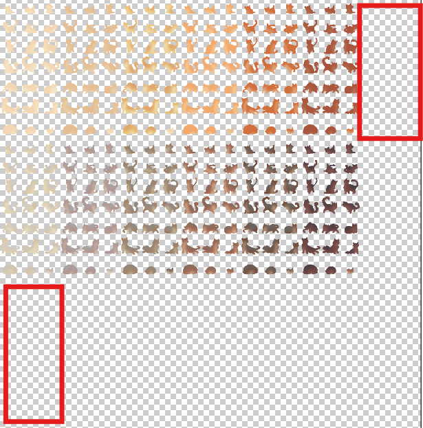

# Adding Sprites
If you would like to add new collars, head to [Palette Maps](palette-maps.md) for more information.

!!! important
    This page **does not cover** adding new clan symbols or spritesheets.

## Navigating the Files
Spritesheets can be found in the `sprites` folder and their matching `DATA` can be found in `sprites/dicts`.  The `DATA` is how we control the creation of individual sprites off of the spritesheet. The `sprites` and `pelts` scripts pull all of their information from the `DATA` file.

## Adding to the Spritesheet
New sprite sets can be added to the spritesheets by simply adding the new set to the end of a row or beginning a new row. 

_You should always keep to the left side of the canvas._

These must be properly spaced on the 50x50 grid to line up with the other sprite sets on the sheet. Spritesheets can be resized if needed to add a new set, generally if the sheet is becoming overly-wide you should add more space to the bottom of the sheet and begin a new row. 

!!! tip "When adding a new pose..."
    New poses can be added to the end of the sheet or inserted at the start or middle! Width or height can be increased in increments of 50 px. Be sure to adjust the `sheet_layout` information in the `pose_sprite_data.json` file. This informs the code of how many columns and rows of sprites it should expect to find. The first number is the number of columns and second number is the rows. 

!!! tip "If removing a pose..."
    If a pose needs to be removed, it can safely be removed from the spritesheet as long as the `pose_sprite_data.json` file's pose list is updated to match. The pose's entry in the pose list should be removed and the index numbers of all other poses should be updated to reflect their new positions on the spritesheet. Conversion of old saves that utilize the removed pose will be handled automatically by the code without any extra work. **There must always be at least one of each pose type to avoid errors (i.e. at least one kitten, one adolescent, one adult, ect.) Para and sick sprites should not be removed.**)

## Adding Sprites to their DATA Sheet
Once you've completed your changes to the spritesheet, the matching `DATA` sheet will need to be altered. This is the last step! Once the `DATA` sheet is altered, the new sprites should appear in game.

Not all `DATA` sheets hold the same information, but they will all at least contain a `spritesheet` or `spritesheets` key and a `sprite_list` key. Adding a new sprite set typically only requires the alteration of the `sprite_list`. 

The `sprite_list` will be a list containing multiple lists or dicts. Each list/dict represents a single row of the spritesheet, starting at the top and going down. These hold the names of each sprite set within that row, the list/dict will begin on the left side of its row and continue to the right.

If you have added your new sprite set to the end of a row, then you will locate that row's list/dict and add the name of the new set to the end. If you have created a new row, then you will need to add a new list/dict to the end of the `sprite_list`.

### Individual DATA Sheet Information
As mentioned, some DATA sheets contain more information than others. At it's most basic, a sheet will have a `spritesheet` string and a `sprite_list` that contains a list of lists. The more intricate aspects of certain DATA sheets is detailed below.

| DATA sheet                   | `spritesheet`                          | `sprite_list`                                                                                                                                |
|------------------------------|----------------------------------------|----------------------------------------------------------------------------------------------------------------------------------------------|
| `eye_sprite_data`            | List containing both eye spritesheets. | List containing dicts, each dict contains key:value pairs for `"NAME": "color category"`. Allowed colors are `yellow`, `green`, or `blue`.   |
| `skin_sprite_data`           | Name of the spritesheet.               | List of lists containing name information.                                                                                                   |
| `plant_sprite_data`          | Name of the spritesheet.               | List of dicts, each dict contains key:value pairs for `"NAME": "sprite position"`. Allowed sprite positions are `head`, `body`, and `tail`.  |
| `wild_sprite_data`           | Name of the spritesheet.               | List of dicts, each dict contains key:value pairs for `"NAME": "sprite position"`. Allowed sprite positions are `head`, `body`, and `tail`.  |
| `scar_sprite_data`           | Name of the spritesheet.               | List of lists containing name information.                                                                                                   |
| `scar_missing_sprite_data`   | Name of the spritesheet.               | List of lists containing name information.                                                                                                   |
| `white_patches_sprite_data`  | Name of the spritesheet.               | List of dicts, each dict contains key:value pairs for `"NAME": "white amount"`. Allowed white amounts are `little`, `mid`, `high`, `mostly`. |
| `tortie_patches_sprite_data` | Name of the spritesheet.               | List of lists containing name information.                                                                                                   |

The pelt `DATA` sheet is particularly complex due to how integral it is to the multiple areas of the cat's sprite. Additions to this sheet should be discussed with senior contributors beforehand, as we are rather choose-y about adding new colors or patterns to the game.

| Section              | Information                                                                                                                                                      |
|----------------------|------------------------------------------------------------------------------------------------------------------------------------------------------------------|
| `spritesheet`        | Dict containing key:value pairs for `"spritesheet name": [save file name]`.                                                                                      |
| `sprite_list`        | List of dicts containing key:value pairs for `"NAME": "color category"`. Possible color categories are: `white`, `black`, `ginger`, and `brown`.                 |
| `pattern_names`      | List of all pattern names.                                                                                                                                       |
| `pattern_categories` | Dict containing key:value pairs for `"category name": [save file name for all patterns within the category]`. You generally should not be adding new categories. |

The pose `DATA` sheet is also unique.

| `spritesheet`                                                                                | `sheet_layout`                                                         | `poses`                                                                                                                                                                                                  |
|----------------------------------------------------------------------------------------------|------------------------------------------------------------------------|----------------------------------------------------------------------------------------------------------------------------------------------------------------------------------------------------------|
| List of all lineart-related spritesheets, such as lineart, gradients, overlays, and shaders. | List containing the columns and rows of sprites expected on the sheet. | Dicts containing key:value pairs for `"pose save name": "pose index on the spritesheets"`. Pose index is counted starting from the top left corner of the sheet and moving left-to-right, top-to-bottom. |

!!! tip "Adding New Pose Names"
    Pose save names should not be changed unless you are prepared to handle the conversion of old saves. New poses should be added following the name convention (i.e. if you are adding a new kitten pose, call it `"kitten3"`.)  Poses are automatically compiled into lists based off the portion of their name preceding the number. So if `"kitten3"` was added, it would automatically be made a pose option for all kittens being generated without any extra coding work being required. This does not extend to sick and para sprites, if you plan to add those then you'll also need to do some code work.

