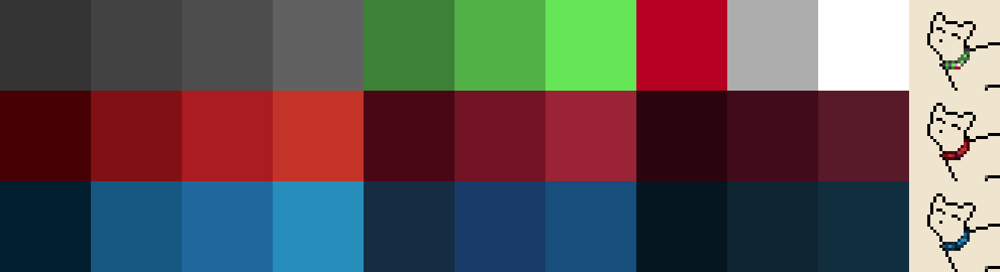

# Palette Maps

Currently, we utilize palette maps for our collars. Maps allow us to create many color variations of a sprite without having to create a separate sprite set for each color.

## Navigating the Files
Within the `sprites` folder, you'll find the `acc_collars.png` spritesheet and the `palettes` folder.

`acc_collars.png` holds all the collar sprite mapping while `palettes` holds the files for each `style`'s palette map. 

!!! tip
    Throughout this doc we'll refer to `style` and `style_type`. Collars are broken down into `style_type` such as `BOW`, `LEATHER`, and `NYLON`. Each row of the `acc_collars.png` file is a new `style_type`. Each sprite within a row is a `style` within that `style_type`.

`palette` files are named as such: `acc_collars{STYLE_TYPE}_palette`. Some `style_type` will include multiple descriptors separated by `_`, such as: `LEATHER_BELL_GRADIENT`. Every `style_type` should begin with it's `style` (i.e. `LEATHER` is the style of `LEATHER_BELL_GRADIENT`.)

We also utilize the `collar_sprite_data.json` file in `sprites/dicts`. This holds our `style_data`, essentially an array of our `style`, `style_type` and color palettes. This is where all sprite name information is pulled from.

## Utilizing the Spritesheets and Palettes
Upon viewing the spritesheet, you'll notice that the sprites are mostly greyscale, with some pops of color. The colors used here will not be seen in-game, rather they are a "map" used to tell the code where our palette colors should go. 

This means that colors used in our spritesheet could be anything, but should be selected with a human gaze in mind. While the code can tell the miniscule differences between 5 different dark grays, we will have significantly more trouble. 

These sprites should generally be a clearly defined grayscale with important features highlighted in bright color. For example, the LEATHER collars are grayscale with red defining the edges of the buckle. This makes it easy for a human viewer to understand that this is an important feature and much easier to identify which palette color is associated with it.

!!! important
    An exception here is our standard black outline for parts of the accessory that go outside the cat sprite lines. This outline should still be pure black on the spritesheet.

Each palette `png` can be viewed as rows. The top row is our "base" color palette, aka the color palette already utilized in our spritesheet. Each following row is a new color palette with the color in each column being associated with the top "base" color. This is how we tell the code which color goes where.



## Adding a New Color
If you would like to add a new color palette to a `style_type`, it's as simple as opening the associated palette `png` and adding a new row at the bottom of the `png.` 

Then, head to the `collar_sprite_data.json` and add the name of your new color palette to the end of that `style_type` list.

The accessory should now be accessible in game with the new color palette!

## Adding a New Style
If you would like to add a new `style` to a `style_type`, you'll have to do some work within the spritesheet. Remember, each row is a different `style`, so you'll be adding your new `style_type` to the end of it's intended `style` row. It's alright to extend the width of the spritesheet file if you need to.

Then, create the sprite set for your new `style_type`. Remember, the colors used here are just a map for the code to follow; they won't be seen in game. Make sure it's easy to see the important features of your `style_type`.

Once you're finished with the spritesheet, you'll have to make a new palette file for the `style_type`. This should be named following our file naming convention discussed at the start of this doc. 

The top row of this `png` will be the colors you used on the spritesheet. The black outline doesn't need to be included here, but all the other colors you used do! Try to arrange them in an intuitive fashion so that it will be easier for future editors to understand how the palette translates to the sprite. Following color palettes are added exactly as already discussed.

To add the new `style` to the `acc_collars_sprite_data.json`, you'll add a new list to the end of the associated `style_type` dict. Note that the order of these lists has to match the row order of the sprites in the spritesheet.

You'll also need to do some additional work to ensure the `style` name displays correctly on cat profiles! Head to the `resources/lang/en/cat/accessories.en.json` file. At the end of this file you'll add a new dict for your `style` formatted like this example:

```json
        "NYLON_BELL_GRADIENT": {
            "zero": "colorful belled nylon collar",
            "many": "colorful belled nylon collars",
            "one": "colorful belled nylon collar"
        }
```

`"zero"` is the profile display name while `"many"` and `"one"` are the plural and singular forms used when referencing this accessory in event text.

## Adding a New `style_type`
If you would like to add a new `style_type` entirely, you'll need to add a new row to the bottom of the spritesheet. Then, create whatever `style` sprites you desire in that row!

Once you've edited the spritesheet and added the palette `png` files, you'll add the new `style_type` to the `collar_sprite_data_json`. The new `style_type` should be added as a new dict at the end of the `style_data` list.
